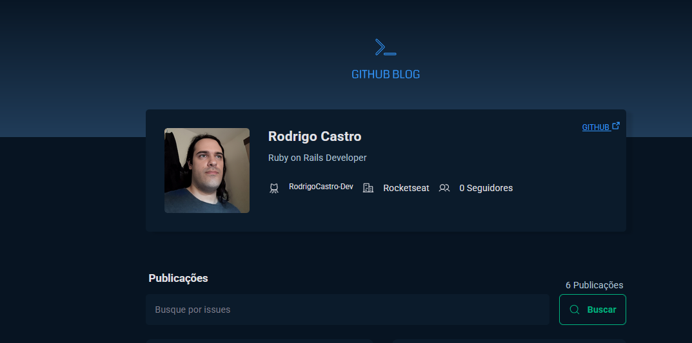

# 🚀 GitHub Blog

A **React-based blog** that fetches data from the **GitHub API** and displays user profiles and repository issues. This project was created to practice working with **external APIs** while utilizing modern React features.

## 📸 Preview  


## 🎯 Features
✅ Fetches and displays **GitHub profiles**  
✅ Lists **repository issues** with a search bar  
✅ **Issue detail page** for in-depth information  
✅ **Client-side routing** with React Router  
✅ **State management** using React hooks  
✅ **Dynamic searching** for issues  

## 🛠️ Technologies Used
- **React** (with Hooks)
- **React Router DOM** (for navigation)
- **Axios & Fetch API** (for API calls)
- **Styled Components / CSS Modules** (for styling)
- **useContext, useEffect, useState** (state management)
- **Vite / Webpack** (for bundling)
- **Json-server** (for API data)

## 🏃 Getting Started

### 🔧 Prerequisites  
Make sure you have **Node.js** and **npm** installed.  
You can check by running:
```sh
node -v
npm -v
```

### 🚀 Installation & Setup
1. Clone the repository:  
   ```sh
   git clone https://github.com/your-username/github-blog.git
   cd github-blog
   ```
2. Install dependencies:  
   ```sh
   npm install
   ```
3. Start the development server:  
   ```sh
   npm run dev
   ```
4. Start the back-end server:  
   ```sh
   npm run dev:server
   ```
5. Open in the browser:  
   ```
   http://localhost:5173
   ```

### ⭐ **If you like this project, consider giving it a star on GitHub!** ⭐  
